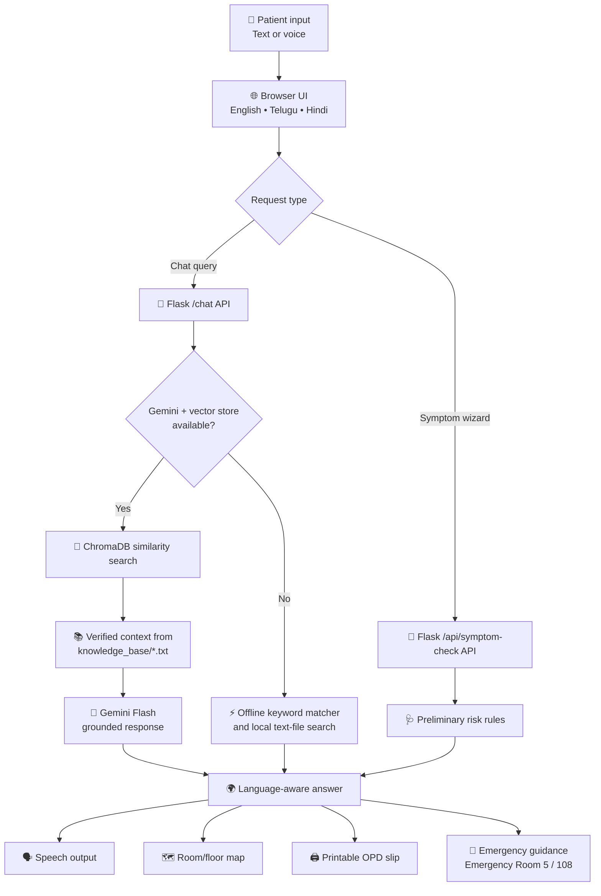

# 🏥 Tension Padaku (టెన్షన్ పడకు)

### Voice-first, trilingual OPD navigation and preliminary health triage for Local hospital in Telangana

> **One conversation. One clear route. Less tension at the hospital.**

Tension Padaku is a practical healthcare information and navigation assistant for **Government Hospital, Kurnool**, also known as Pedda Hospital. It helps patients—especially elderly, rural, low-literacy, and regional-language users—understand **where to go next** without needing to know English, a hospital department, or a room number in advance.

Patients can speak or type in:

- **English**
- **తెలుగు (Telugu)**
- **हिंदी (Hindi)**

The assistant combines a grounded hospital knowledge base, retrieval-augmented generation (RAG), browser-based speech recognition and speech output, a preliminary symptom-routing wizard, visual floor navigation, emergency calling shortcuts, and printable OPD slips.

---

## 📌 Project Overview

A large government hospital can be difficult to navigate even when the care itself is available. A patient may arrive from a rural area and still be unsure:

- Which department should they visit?
- Which OPD room should they go to?
- Is the symptom general, specialty-related, or an emergency?
- How do they ask for help in a crowded hospital?
- What should they do if the internet or AI service is unavailable?

Tension Padaku reduces that uncertainty with a simple interaction:

> **Patient asks a question → the system identifies the relevant verified hospital record → it explains the department, room, and next action.**

The project is intentionally **navigation-first**. It does not diagnose diseases or replace a doctor. Its goal is to get a patient from the hospital entrance to the appropriate OPD or emergency route with less confusion and fewer avoidable mistakes.

### The two questions it helps answer

| Patient need | What the assistant provides |
| :--- | :--- |
| **Where should I go?** | Department, room number, floor/location, and next steps |
| **What kind of care should I seek?** | Preliminary risk category and a safe routing recommendation |

---

## 💡 What Makes This More Than a Chatbot?

### 1. Accessible for everyone: voice-first and trilingual

A patient does not need to be comfortable typing or reading English. The browser converts speech to text, the assistant processes the request, and the response can be read aloud in the selected language.

### 2. Grounded in hospital-specific information

The primary Gemini response is constrained by retrieved context from the project's `knowledge_base/` files. The prompt explicitly prevents invented room numbers, doctor names, timings, prices, appointments, or services.

### 3. Graceful offline fallback

A hospital cannot depend on every cloud service being available. When the Gemini client, API key, vector store, or generation request is unavailable, a local keyword and knowledge-file matcher continues to answer common navigation questions.

### 4. Practical preliminary triage

The symptom checker uses symptom selection, duration, and severity to route a patient toward General Medicine, ENT, Cardiology, Orthopaedics, or Emergency. Emergency signals are prioritized and linked to **108**.

### 5. Information that patients can act on

Answers are not limited to a text bubble. The interface includes:

- An interactive room/floor map
- Department directory with filtering
- Emergency SOS shortcuts
- Voice playback
- Printable OPD navigation slips
- OPD registration guidance

---

## 🏗️ System Architecture



### Request lifecycle

1. The patient enters text or starts voice input.
2. `static/script.js` sends the message, conversation history, and selected language to Flask.
3. `/chat` forwards the request to `rag.py`.
4. When Gemini and ChromaDB are available, the system retrieves relevant chunks and asks Gemini to answer only from that context.
5. If the AI path is unavailable or fails, the local matcher scans verified text files and uses deterministic department/room rules.
6. The browser renders Markdown and adds language-appropriate speech, map, print, and emergency actions.

---

## 🎥 Try the Application

There is no external demo link required to understand the project. Run it locally using the [Getting Started](#-getting-started) instructions and try these prompts:

```text
I have a cold and fever. Which room should I go to?
Cardiology ekkada undi?
Emergency department kaha hai?
मुझे सर्दी और बुखार है। कमरा कौन सा है?
```

You can also click the built-in suggestion cards, use the microphone button, switch languages, open the floor map, run the symptom checker, or print an OPD navigation slip.

---

## 🌟 Key Features

### 🗣️ Voice-first interaction

- Browser-native **Speech-to-Text (STT)** through the Web Speech API
- Automatic submission after a voice query is recognized
- **Text-to-Speech (TTS)** playback for assistant answers
- Language-aware recognition and speech settings for English, Telugu, and Hindi
- Clear listening indicator and microphone state
- Graceful browser-support messaging when speech features are unavailable

### 🌐 Trilingual experience

The UI includes translations for the primary navigation and assistant labels. The backend also passes the selected language to Gemini and the offline matcher, allowing common room guidance to remain useful when the generative service is unavailable.

| Code | Language | UI locale | Speech locale |
| :---: | :--- | :--- | :--- |
| `en` | English | English | `en-IN` |
| `te` | Telugu | తెలుగు | `te-IN` |
| `hi` | Hindi | हिंदी | `hi-IN` |

### 📚 Grounded RAG navigation

- Text files are loaded from `knowledge_base/`
- Documents are split into overlapping chunks
- Gemini embeddings create a local ChromaDB collection
- Similarity search retrieves up to four relevant chunks
- The final prompt separates conversation history, rewritten search context, retrieved records, and the current question
- Safety rules prohibit invented hospital-specific information

### ⚡ Smart offline fallback

The local engine covers common questions about:

- General Medicine
- Cardiology
- ENT
- Orthopaedics
- Laboratory
- ECG
- Pharmacy
- Emergency
- Hospital location and contact
- Room directories
- Common symptom-to-department routing

If Gemini is unavailable, the application does not need to return an empty error page for these common navigation scenarios. It returns a verified-looking local response and clearly identifies that it is operating in offline knowledge-base mode.

### 🩺 Preliminary symptom risk assessment

The symptom wizard collects:

1. One or more symptom categories
2. Duration
3. Severity
4. Selected interface language

It then returns a risk badge, department, room, guidance, and emergency contact. This is a **navigation aid**, not a diagnosis or a replacement for clinical triage.

### 🗺️ Visual hospital navigation

The application includes a simple floor-oriented room map:

- **Ground Floor:** Emergency Room 5, Pharmacy Room 50, Laboratory Room 45, and OPD registration
- **First Floor:** General Medicine Room 12, ENT Room 18, Cardiology Room 25, and ECG Room 46
- **Second Floor:** Orthopaedics Room 30

The map is an in-app navigation aid. Patients should still follow current hospital signage and staff instructions.

### 🚨 Emergency access

The Emergency SOS interface provides direct links for:

- **108 emergency ambulance**
- **GGH Kurnool Superintendent Desk: 08518-279030**
- Emergency Department **Room 5**

Emergency symptoms such as severe breathing difficulty, loss of consciousness, severe bleeding, sudden weakness, or severe chest pain should always prompt immediate professional medical care.

---

## 🧭 Product Experience

### Patient journey

```text
Patient arrives at GGH Kurnool
        ↓
Patient asks in text or speaks in a preferred language
        ↓
Assistant identifies the intended department or risk category
        ↓
Patient receives a grounded room/route response
        ↓
Patient can listen to the answer, view the map, or print a slip
        ↓
Patient follows current hospital signage and staff guidance
```

### Illustrative example

An elderly patient from a village near Kurnool arrives with a fever and does not know which OPD to visit. Instead of wandering between counters, the patient asks:

> “జ్వరం ఉంది. ఏ విభాగానికి వెళ్లాలి?”

The assistant provides a simple General Medicine route based on the project-provided record:

> **General Medicine — Room 12**

The answer can be read aloud in Telugu, shown on the map, and printed as an OPD navigation slip. If the patient instead reports severe breathing difficulty or loss of consciousness, the emergency path directs them to **Room 5 / 108** instead.

> The example is illustrative. It is not a diagnosis and does not replace assessment by hospital staff.

---

## 🏥 Verified Project Room Directory

The following room mappings are supplied by the project and used consistently by the application:

| Department / Service | Room | Interface location |
| :--- | :---: | :--- |
| Emergency & Trauma | **5** | Ground Floor, East Wing |
| General Medicine | **12** | First Floor, Wing A |
| ENT — Ear, Nose & Throat | **18** | First Floor, Wing B |
| Cardiology | **25** | First Floor, Wing C |
| Orthopaedics | **30** | Second Floor, Ortho Block |
| Laboratory | **45** | Ground Floor, West Wing |
| ECG | **46** | First Floor, adjacent to Cardiology |
| Pharmacy | **50** | Ground Floor, Central Corridor |

> **Important:** Room information is project-provided navigation data. Confirm current signage, availability, registration requirements, and hospital procedures at the facility. The knowledge base does not provide verified doctor rosters, OPD timings, appointment availability, or prices.

---

## 🧠 Knowledge Base and Grounding Policy

The application stores hospital knowledge in small, reviewable text files:

| File | Purpose |
| :--- | :--- |
| `department_guidance.txt` | Symptom-to-department navigation and safety boundaries |
| `departments.txt` | Verified service/technical areas and source limitations |
| `emergency_information.txt` | Emergency service guidance and ambulance information |
| `faq.txt` | Frequently asked hospital, room, and service questions |
| `hospital_information.txt` | Hospital identity, location, district, and contact |
| `room_information.txt` | Canonical department-to-room mappings |
| `services.txt` | Services identified in government records |
| `symptom_guidance.txt` | Preliminary symptom and department routing guidance |

The final Gemini prompt follows these principles:

1. Use only the retrieved hospital context.
2. Do not invent room numbers, department names, doctors, timings, prices, or appointments.
3. State when verified information is unavailable.
4. Provide educational navigation information, not a diagnosis.
5. Encourage immediate professional care for serious or rapidly worsening symptoms.
6. Keep answers concise and understandable for hospital visitors.

---

## 🧪 Preliminary Symptom Routing Logic

The current symptom endpoint uses deterministic rules so that routing remains available without Gemini. Its behavior is summarized below:

| Selected symptoms / severity | Preliminary result | Room | Safety note |
| :--- | :--- | :---: | :--- |
| Emergency signals such as breathing difficulty, unconsciousness, stroke, severe bleeding, or severe injury | High / Emergency | **5** | Seek immediate care or call 108 |
| Bone, joint, fracture, or musculoskeletal symptoms | Moderate | **30** | Use Orthopaedics guidance |
| Ear, nose, or throat symptoms | Mild or Moderate based on duration | **18** | Use ENT guidance |
| Chest, heart, or blood-pressure symptoms | High | **25** | Sudden or acute pain should go to Emergency Room 5 |
| Other general symptoms | Mild / General | **12** | Start with General Medicine |

The rules are intentionally simple and transparent. They are not a clinical triage protocol, do not diagnose conditions, and should be reviewed by qualified healthcare professionals before being used in a real hospital deployment.

---

## 🛠️ Tech Stack and Engineering Rationale

| Layer | Technology | Why it is used |
| :--- | :--- | :--- |
| Backend | Python + Flask | Small, clear REST API and easy local deployment |
| AI orchestration | LangChain | Document loading, splitting, retrieval, and prompt composition |
| Vector database | ChromaDB | Local, persistent semantic search for hospital records |
| Embeddings | Gemini `gemini-embedding-001` | Multilingual document representation through the configured Gemini API |
| Generative model | Google Gemini Flash | Fast, conversational answers grounded in retrieved context |
| Fallback engine | Python keyword/text matcher | Keeps common navigation available without a working model or network |
| Speech | Web Speech API | Browser-based STT and TTS without a separate speech backend |
| Frontend | HTML5 + Vanilla JavaScript | Lightweight interface with direct control over browser features |
| Styling | CSS3 | Responsive glass-like UI, floor-map states, modals, and print styles |
| Markdown | `marked` via CDN | Formats structured assistant responses in the chat area |
| Configuration | `python-dotenv` | Loads local API/model settings from `.env` |

This stack keeps the prototype easy to run on a local machine while preserving clear extension points for a production deployment.

---

## 🏛️ Project Structure

```text
Tension-Padaku/
│
├── app.py                         # Flask app, chat API, symptom triage, clear-chat endpoint
├── rag.py                         # Gemini client, ChromaDB RAG, rewriting, offline fallback
├── test_gemini.py                 # Gemini connectivity smoke test
├── requirements.txt              # Python dependencies
├── .env.example                  # Example environment variables
├── .gitignore                    # Local secrets, virtualenv, and generated ChromaDB data
├── README.md                     # Product, architecture, setup, and usage documentation
│
├── knowledge_base/               # Verified hospital records used for grounding
│   ├── department_guidance.txt
│   ├── departments.txt
│   ├── emergency_information.txt
│   ├── faq.txt
│   ├── hospital_information.txt
│   ├── room_information.txt
│   ├── services.txt
│   └── symptom_guidance.txt
│
├── static/
│   ├── style.css                 # Responsive UI, modals, map, emergency, and print styles
│   └── script.js                 # Chat, voice, language, triage, map, and print behavior
│
└── templates/
    └── index.html                # Main application interface and modal dialogs
```

Generated runtime data such as `chroma_db/` and the `.env` file are intentionally ignored by Git.

---

## 🚀 Getting Started

### Prerequisites

- Python **3.10 or newer**
- pip
- A Google Gemini API key for the full RAG/Gemini path
- A modern browser with JavaScript enabled
- Chrome, Edge, or Safari is recommended for speech features

### 1. Clone the repository

```bash
git clone https://github.com/vishalsingh2972/Tension-Padaku.git
cd Tension-Padaku
```

### 2. Create and activate a virtual environment

#### Windows (PowerShell or Command Prompt)

```bash
python -m venv venv
venv\Scripts\activate
```

#### macOS / Linux

```bash
python3 -m venv venv
source venv/bin/activate
```

### 3. Install dependencies

```bash
python -m pip install --upgrade pip
pip install -r requirements.txt
```

### 4. Configure Gemini

Copy the example environment file:

#### Windows Command Prompt

```bat
copy .env.example .env
```

#### PowerShell

```powershell
Copy-Item .env.example .env
```

#### macOS / Linux

```bash
cp .env.example .env
```

Then edit `.env`:

```env
GEMINI_API_KEY=your_actual_gemini_api_key_here
GEMINI_MODEL=gemini-3.5-flash
```

Never commit `.env` to Git.

### 5. Build the local vector store

With a valid API key configured, build the ChromaDB index once:

```bash
python rag.py
```

The command loads all `knowledge_base/*.txt` files, splits them into chunks, and stores the collection in `chroma_db/`.

The Flask application currently uses a **lazy vector-store cache**; building the index as a separate step avoids unnecessary embedding work at application startup.

### 6. Run the application

```bash
python app.py
```

Open:

```text
http://127.0.0.1:5000
```

Optional runtime settings can also be placed in `.env`:

```env
PORT=5000
FLASK_DEBUG=True
```

> For local emergency calls, use the browser/device phone application. Do not rely on this web app as a replacement for emergency services.

---

## ⚡ Run in Offline Navigation Mode

The common local fallback path can be demonstrated without a Gemini key:

1. Install the dependencies.
2. Leave `GEMINI_API_KEY` unset or unavailable.
3. Start the application with `python app.py`.
4. Ask a supported question such as `Where is Cardiology?` or `Which room is the laboratory?`.

When the Gemini client or vector store is unavailable, `ask_rag()` routes to `offline_knowledge_base_search()`. This mode is designed for deterministic navigation and local knowledge-file matching, not open-ended medical conversations.

---

## 🧪 Run the Gemini Connectivity Check

To verify that the configured key and model can call Gemini:

```bash
python test_gemini.py
```

This is a connectivity smoke test only. It is not a replacement for testing the RAG pipeline or the Flask routes.

---

## 🖥️ Using the Application

### Text chat

1. Select a language from the top-right selector.
2. Type a question in the input field.
3. Press **Enter** or click the send button.
4. Use the message action buttons to listen, print a slip, or open the map.

### Voice input

1. Select the preferred language.
2. Click the microphone button.
3. Speak your question when the listening indicator appears.
4. The recognized text is placed in the input and sent automatically when recognition completes.

Speech recognition support and language quality depend on the browser, operating system, microphone permissions, and available browser speech services.

### Symptom checker

1. Open **Symptom Checker** from the sidebar or top bar.
2. Select one or more symptom categories.
3. Choose duration and severity.
4. Click **Assess Risk & Find Department**.
5. Review the result, print a slip, or ask the chatbot for more information.

### Floor map

Open **Floor Map** to switch between all buildings, ground floor, first floor, and second floor. Select a room to see its project-provided location and walking guidance.

### Clear chat

Clear Chat removes the in-memory conversation from the current browser page and resets the welcome message. It does not delete server-side records because this prototype does not persist chat history.

---

## 🔌 API Reference

### `GET /`

Renders the main application interface.

### `POST /chat`

Accepts a user message and returns a grounded or fallback response.

```json
{
  "message": "Where is Cardiology?",
  "history": [],
  "language": "en"
}
```

Example response:

```json
{
  "response": "### Cardiology Information\n\nCardiology: Room 25"
}
```

### `POST /api/symptom-check`

Accepts symptom wizard selections and returns preliminary routing information.

```json
{
  "symptoms": ["Chest Pain / Pressure"],
  "duration": "1-3 days",
  "severity": "moderate",
  "language": "en"
}
```

Example response fields:

```json
{
  "risk_level": "High",
  "color": "#e53935",
  "department": "Cardiology",
  "room": "Room 25",
  "guidance": "Cardiac and blood pressure evaluations are handled by Cardiology...",
  "emergency_contact": "108",
  "hospital": "Government General Hospital (GGH), Kurnool"
}
```

### `POST /clear-chat`

Returns a clear-chat confirmation. The current client clears its own in-memory history after calling this endpoint.

---

## 🔐 Privacy, Safety, and Responsible Use

Tension Padaku is a navigation and health-information prototype, not a medical device.

- Do not use chatbot output as a diagnosis or prescription.
- Do not delay emergency care while waiting for a chatbot response.
- Call **108** or go to the nearest emergency department for a life-threatening emergency.
- Do not share personally identifiable health information in public or shared devices.
- When Gemini is enabled, the current chat message and conversation history are sent to the configured AI service for processing.
- Browser speech recognition may involve browser or operating-system speech services; users should review their browser privacy settings.
- Room, department, service, and floor data in this repository is project-provided. Hospital administrators should verify it before a public deployment.
- Any real-world triage rules, emergency routing, or clinical content require review by qualified medical and hospital professionals.

---

## 🧪 Current Status and Testing

### Current status

The repository contains a functional local prototype with:

- Flask page rendering
- Grounded Gemini/RAG path when configured
- Local keyword/text-file fallback
- English, Telugu, and Hindi UI and speech settings
- Preliminary symptom routing
- Interactive room map
- Emergency contact shortcuts
- Printable navigation slips

### Manual verification checklist

- Start the app with a valid Gemini key and build the vector store.
- Ask about Cardiology, ENT, Orthopaedics, Pharmacy, Laboratory, and Emergency.
- Switch between English, Telugu, and Hindi in the UI.
- Test text-to-speech playback in a supported browser.
- Test speech recognition with microphone permission.
- Run the symptom checker for a general symptom and an emergency symptom.
- Verify Room 5 and 108 are surfaced for emergency scenarios.
- Open and use each floor-map tab.
- Print an OPD slip and check the room/department fields.
- Stop the network or remove the API key and verify common offline navigation questions still work.

There is currently no complete automated unit/integration test suite. `test_gemini.py` only checks Gemini connectivity.

---

## 🌱 Future Improvements

- **Verified data pipeline:** Add a reviewed source-ingestion and versioning process for hospital room, floor, and service updates.
- **Richer multilingual evaluation:** Measure retrieval and response quality separately for English, Telugu, and Hindi queries.
- **Clinician-reviewed triage:** Replace heuristic symptom rules with versioned, auditable rules approved by hospital clinicians.
- **Offline cache improvements:** Package the latest approved hospital records with the frontend for use during broader connectivity outages.
- **Accessibility testing:** Test with elderly and low-literacy users, screen readers, keyboard-only navigation, and low-bandwidth devices.
- **Verified schedules:** Add doctor rosters, OPD timings, holidays, and registration availability only when an official data source is available.
- **Live hospital status:** Integrate an approved source for room availability, registration counters, and temporary closures.
- **Progressive Web App support:** Make the interface installable and more resilient on low-end mobile devices.
- **Deployment hardening:** Add authentication/rate limiting where required, structured logging, health checks, and production configuration.
- **User testing:** Measure time-to-route, successful room arrival, fallback usage, and patient comprehension.

---

## 🧭 What I Learned

- **Accessibility is an engineering requirement, not a cosmetic feature.** Voice, language, and readable instructions are central to whether the product can reach its intended users.
- **Grounding changes the trust model.** A healthcare assistant should be conservative: when information is not verified, it should say so rather than invent a room or schedule.
- **Failure behavior is part of the product.** A local fallback is more useful in a hospital than a generic “something went wrong” message.
- **A useful answer has a next action.** Department and room information becomes actionable when paired with a map, spoken instructions, or a printable slip.
- **Simple deterministic routing has value.** Preliminary triage can be transparent and inspectable, but it must be clearly separated from diagnosis and reviewed by professionals.

---

## 🤝 Contributing

Contributions are welcome, especially those that improve patient accessibility, grounding quality, multilingual support, or offline behavior.

### Contribution checklist

1. Fork the repository and create a focused feature branch.
2. Keep hospital facts traceable to an approved source or clearly mark them as project-provided data.
3. Do not add diagnoses, prescriptions, or unverified doctor/schedule information.
4. Test the affected language and fallback paths.
5. Run the relevant manual checks or add tests where appropriate.
6. Submit a pull request describing the user-facing change and safety impact.

If you discover an incorrect room number, emergency instruction, or hospital detail, please flag it before using the application operationally.

---

## ❤️ Built for Patients

> **A patient should not need to know the hospital’s internal language before they can reach the right care.**

Tension Padaku aims to make hospital navigation feel less intimidating and more human—one clear question, one verified route, and one less reason to feel lost.

---

## 📄 License

This project is intended for release under the **MIT License**. Add the corresponding `LICENSE` file to the repository before public distribution.